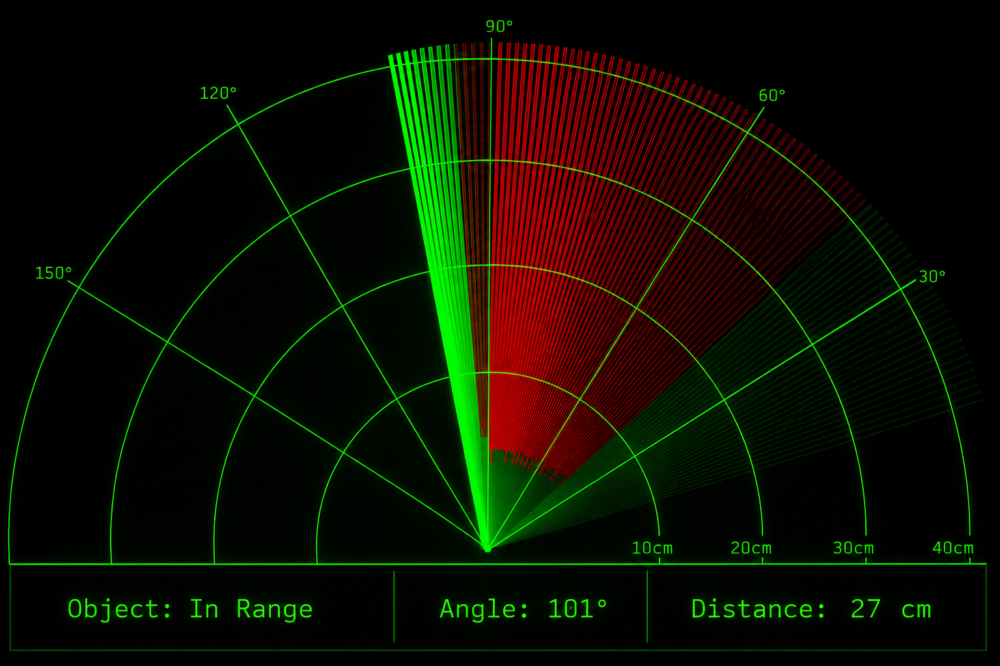

# Ultrasonic Radar System Using Arduino

## About

This project demonstrates a real-time radar system using an Arduino Uno, HC-SR04 Ultrasonic Sensor, and SG90 Servo Motor. Distance measurements are collected by the ultrasonic sensor and visualized through a Processing-based radar interface.

## Project Structure

```text
Arduino_Ultrasonic_Radar/
├── Arduino_Radar_Display.pde
├── Arduino_Radar_System.ino
├── Radar_Output_UltrasonicSensor.png
└── README.md
```

## Hardware Used

- Arduino Uno
- HC-SR04 Ultrasonic Sensor
- SG90 Servo Motor
- Jumper Wires
- Breadboard
- USB Cable

## Working Principle

The HC-SR04 ultrasonic sensor is mounted on a servo motor that continuously sweeps between 0° and 180°. During the sweep, the sensor measures the distance to nearby objects and sends the angle-distance data to the Arduino.

The Arduino transmits this data through serial communication to the Processing application, which displays the information on a radar-style graphical interface showing:

- Object position
- Detection angle
- Distance from the sensor
- Real-time radar sweep

## Features

- Real-time radar visualization
- Ultrasonic distance measurement
- Servo-based scanning mechanism
- Object detection and tracking
- Serial communication between Arduino and Processing
- In-Range / Out-of-Range indication

## Output



## How to Run

1. Connect the HC-SR04 Ultrasonic Sensor and SG90 Servo Motor to the Arduino Uno.
2. Open `Arduino_Radar_System.ino` in Arduino IDE.
3. Select the correct Board and COM Port.
4. Upload the code to the Arduino.
5. Open `Arduino_Radar_Display.pde` in Processing IDE.
6. Update the COM port in the code if required.
7. Run the Processing sketch.
8. Place an object within the sensor's range and observe the radar display in real time.
